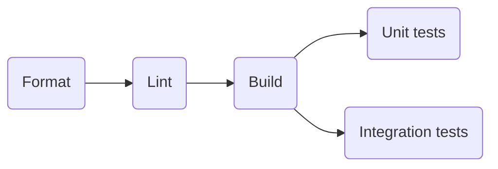
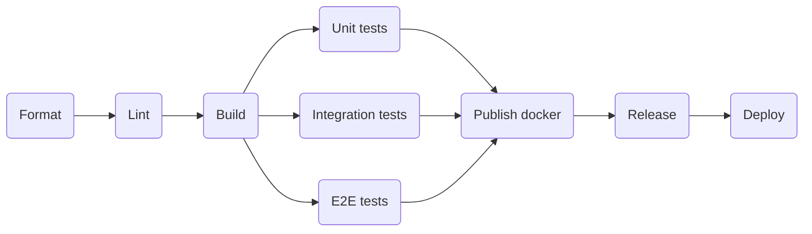

# CI/CD

CI/CD конвейер реализован с использованием [Github Actions](https://docs.github.com/ru/actions).

## `.github` директория

```shell
$ tree .github 
.github
├── actions
│   ├── build-go
│   │   └── action.yml
│   ├── deploy
│   │   └── action.yml
│   ├── format-go
│   │   └── action.yml
│   ├── lint-go
│   │   └── action.yml
│   ├── publish-docker
│   │   └── action.yml
│   ├── release
│   │   └── action.yml
│   └── test-go
│       └── action.yml
└── workflows
    ├── dev-worlflow.yaml
    └── release-worlflow.yaml
```

В `.github` директории находятся все конфигурации для работы CI/CD конвейера.
Используемые действия находятся в директории `.github/actions`, готовые пайплаины - `.github/workflows`.

## Пайплаины

При событиях `pull request` и `push` в ветки с префиксами `feature`, `bugfix`, `hotfix` и `docs` запускается
`dev-worlflow.yaml`.



При событиях `push` с тегами запускается `release-worlflow.yaml`.

